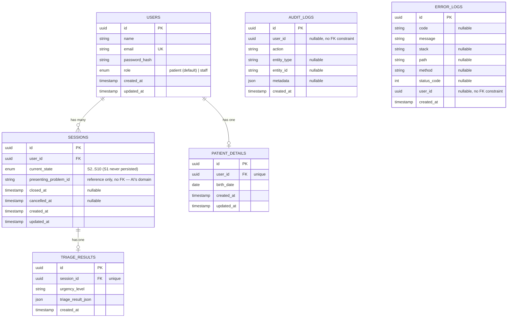

# دیاگرام رابطه جداول

## توضیح تصمیمات طراحی

### ادغام UserAuthentication در Users
طبق سند تسک، ادغام `UserAuthentication` در جدول `Users` مجاز و به تشخیص من بوده است.
تصمیم گرفتم برای اسپرینت ۱ این دو را ادغام کنم (فیلد `password_hash` مستقیماً در
`Users`)، چون:
- در این مرحله فقط یک روش احراز هویت (ایمیل/پسورد) داریم؛ جدول جدا برای ۱ رکورد
  به‌ازای هر کاربر سربار غیرضروری اضافه می‌کند.
- اگر بعداً نیاز به چند روش auth (OAuth، چند دستگاه، refresh token جداگانه و...)
  پیدا شد، می‌توان بدون تغییر در قرارداد API فعلی (`user` و `token` در پاسخ)،
  یک جدول `UserAuthentication` یا `RefreshTokens` جدا اضافه کرد.

### S1 و S3 هیچ‌وقت persist نمی‌شوند
`S1_initial_state` و `S3_assign_urgency` در دیاگرام state machine "گذرا" هستند:
- `create_session` مستقیماً رکورد را با `S2_collecting_information` می‌سازد
- بعد از پاسخ AI، انتقال `S4 -> S3 -> (S5|S6|S7|S8)` در یک عملیات دیتابیسی انجام می‌شود

این یک تصمیم داخلی پیاده‌سازی است؛ منطق state machine دقیقاً همان مسیر تعریف‌شده
را طی می‌کند، فقط دو state گذرا به‌صورت جداگانه در دیتابیس ذخیره نمی‌شوند.

### جدول جدید `triage_results`
چون `TriageResults` جزو جداول تحت مسئولیت اصلی من است (طبق بخش ۳ سند تسک)،
برای ذخیره خروجی AI (`urgencyLevel` + `triageResultJson`) این جدول را اضافه
کردم؛ رابطه یک‌به‌یک با `sessions`.

### چرا `audit_logs` و `error_logs` روی `user_id` رابطه FK ندارند
عمداً `user_id` در این دو جدول بدون foreign key constraint نگه داشته شده،
چون لاگ‌ها باید حتی بعد از حذف احتمالی یک کاربر هم باقی بمانند (برای بررسی
امنیتی/ممیزی)، و همچنین برخی رویدادها (مثل تلاش ورود ناموفق با ایمیل ناموجود)
اصلاً `userId` معتبری ندارند.

### جدول جدید `patient_details` و منشأ `age`
به درخواست مدیر پروژه/عضو Frontend، `birthDate` در ثبت‌نام الزامی شد و در این
جدول ذخیره می‌شه. `age` مورد نیاز AI حالا سرور-ساید از همین `birthDate` محاسبه
می‌شه (`src/utils/calculateAge.js`) — Frontend دیگه لازم نیست سن رو هر بار در
`submit-symptoms` جدا بفرسته (که می‌تونست بین session‌های مختلف ناهماهنگ بشه).

### `role` روی Users و مسیر staff-finalize
طبق تصمیم مدیر پروژه، `finalize_triage` نقش System داره برای S6/S7/S8 (خودکار
داخل submit-symptoms)، اما S5 (pending_doctor_review) باید باز بمونه تا یک
انسان واقعی (پزشک) تأییدش کنه. برای این مرحله از پروژه (فاز ۱)، یک فیلد
حداقلی `role` (`patient` | `staff`) به `Users` اضافه شد و یک endpoint محدود
(`POST /sessions/:id/staff-finalize`) فقط برای نقش `staff` ساخته شد. ساخت
حساب staff فعلاً فقط دستی (SQL) است؛ پنل واقعی پزشک و مدیریت نقش‌ها، فاز ۲ و
خارج از scope این تیم است.

این‌ها تصمیمات داخلی در محدوده اختیارات من هستند و تغییری در قرارداد JSON با
اعضای دیگر ایجاد نمی‌کنند.
